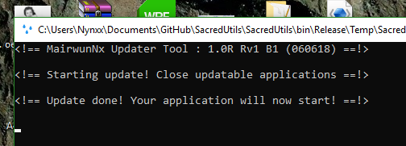

# MairwunNxUpdater
A simple and fast updater for some projects, with using the C# console.

# How Use Or Start Updater.
 
 * Download the source and include to the project. (compiling source requires VS2017+).
 * Download a pre-compiled Updater from the [releases](https://github.com/MairwunNx/MairwunNxUpdater/releases) page.
 
 * Add updater in Project as Resource, and in solution explorer or to folder of project.
 * Extract updater (C#) File.WriteAllBytes(Updater.exe, Properties.Resources.MairwunNxUpdater);
 * When your update downloaded run the updater Process.Start(Updater.exe, "NewUpdate.exe " + CurrentAppnameProject);
 
 * Check it! If you did everything right, your application will be replaced with a new version.